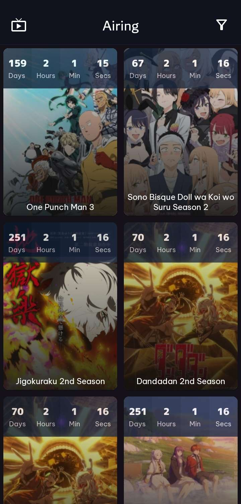

<div align="center">
  <a href="https://github.com/raslenabb12/AnimeDrop">
    
  </a>

# AnimeDrop
</div>
 

## ⚠️ Project Status: Under Active Development

**NOTE:** AnimeDrop is currently in active development. Features are being added and tested regularly.

##  Overview

**AnimeDrop** is an Android application that allows users to browse and get live countdowns for upcoming anime releases. It is built using modern Android development tools and practices.

##  Features

-  Live countdown timer for upcoming anime episodes
-  Image loading with Glide
-  Real-time updates for days, hours, minutes, and seconds
-  Search anime by title
-  Smooth UI using RecyclerView

##  Planned Features

- User favorites/watchlist
- Detailed anime information page
- Notifications before airing time
- Sort/filter options

##  Tech Stack

- **Language:** Kotlin
- **UI:** Android Jetpack (ViewBinding, RecyclerView)
- **Image Loader:** Glide
- **Date/Time:** `java.time` API
- **Data Model:** Custom `AnimeCountdown` class
- **Architecture:** MVVM pattern (planned)

##  Setup Instructions

1. Clone the repository
   ```bash
   git clone https://github.com/raslenabb12/AnimeDrop.git

3. Open the project in Android Studio
4. Let Gradle sync and download dependencies
5. Connect an emulator or device and run the app

## Contributing
Contributions are welcome! If you'd like to fix bugs, suggest features, or improve documentation, feel free to open an issue or pull request.

## License
MIT License

## Disclaimer
AnimeDrop is not affiliated with any official anime source or publisher.

This app is for experimental and educational use only.
